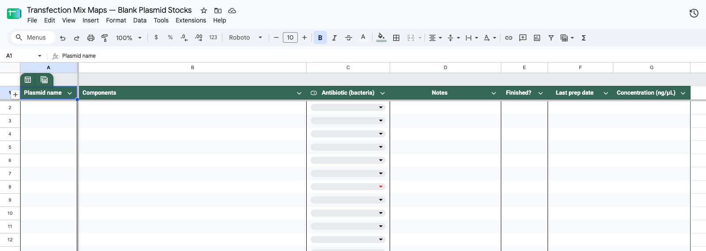
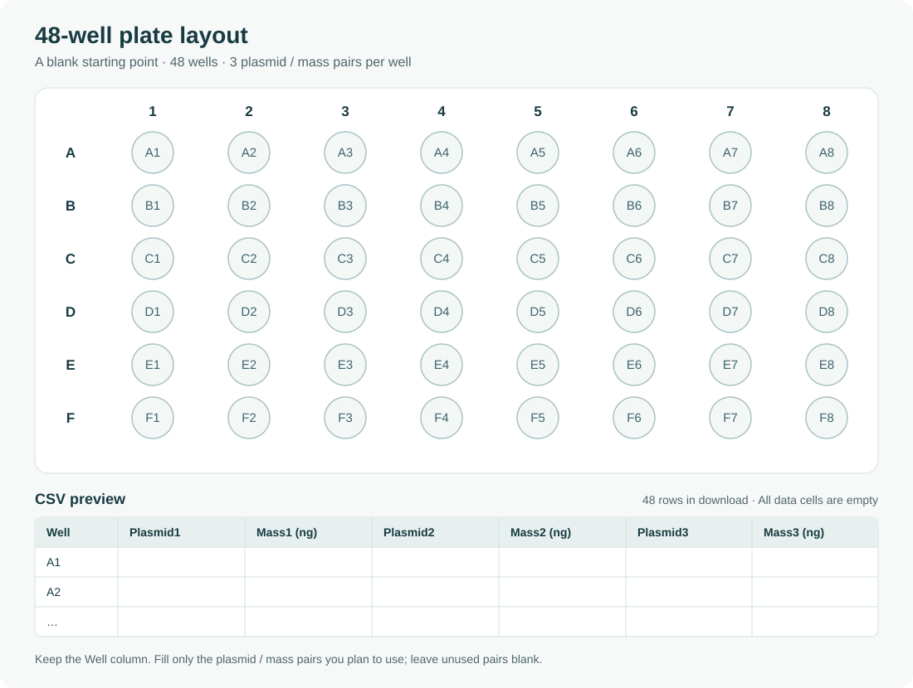

# Transfection Mix Maps · v1.0.1

Create Excel transfection mix maps for **LT1** or **L2000** from plate-layout
CSVs and DNA concentrations in Google Sheets. Preview up to five plates and
save a separate workbook for each one.

**v1.0.1 is a source update.** No v1.0.1 installer has been built or published.
Run this version using [BUILDING.md](BUILDING.md). The currently published
installer is **v1.0.0**, for Apple Silicon Macs running macOS 14 or later, and
includes Python and all dependencies. It does not include the plate-type
features described below.

## Install or update the published v1.0.0 app

1. [Download the v1.0.0 installer](https://github.com/BRPollak/transfection-mix-maps/releases/download/v1.0.0/Transfection-Mix-Maps-1.0.0-arm64.pkg).
2. Quit **Transfection Mix Maps** if it is running.
3. Open the `.pkg` and follow the Installer prompts.
4. Open **Transfection Mix Maps** from **Applications**.

Updating replaces the app and keeps your saved Google connection and preferences.
Keep the small launcher window open while using the app in your browser. Quit
through that window when finished; closing the browser tab alone leaves it running.

The installer is unsigned, and the app uses an ad hoc signature. It is not
Developer ID signed or notarized. If macOS blocks it, follow
[Apple's instructions for opening an app you trust](https://support.apple.com/102445).

## Connect Google Sheets

Set up a Google connection once on each Mac:

1. In [Google Cloud Console](https://console.cloud.google.com/), select or create
   a project and enable **Google Sheets API**.
2. Configure **Google Auth Platform / OAuth consent**. Open **Google Auth
   Platform → Audience**. If you see **Test users**, click **Add users**, enter
   the email address of the Google account you will use with Transfection Mix
   Maps, then click **Save**. This allows that account to sign in.
3. Create an **OAuth client ID** with application type **Desktop app**, then
   download its JSON file.
4. In the app, expand **One-time Google setup**, choose the JSON file under
   **Google desktop client file (.json)**, and press **Save Google client file**.
5. Press **Sign in to Google** and use the account added in step 2, if applicable.
   That account must also own the Sheet or have been given access by its owner.
6. Paste the **Google Sheet URL or ID**, then press
   **Confirm Sheet & refresh concentrations**.

The app requests read-only Sheets access and remembers your sign-in and Sheet.
Refresh concentrations after changing the Sheet. Generation uses the displayed
saved concentrations; data older than 24 hours requires confirmation before use.

## Prepare your inputs

### Download starter templates

Start with these blank resources, then fill in your own stocks and plate contents:

| Resource | Download or copy | What is included |
|---|---|---|
| Google Sheets stock inventory | [Make a Google Sheets copy](https://docs.google.com/spreadsheets/d/1R1vTX8dlPZzP7VYW5ZQKA4B9Uhh7BCWBNDLjdkSBr-4/copy) · [Download workbook (.xlsx)](examples/google-sheets-stocks-template.xlsx?raw=true) | Two formatted inventory tabs with headers and blank stock records. |
| 48-well plate layout | [Download plate CSV](examples/48-well-plate-layout.csv?raw=true) | Wells **A1–F8**, with three blank plasmid/mass pairs per well. |

**Google Sheets template:** the shared template is view-only; make your own
editable copy using the link above. To use the downloaded workbook instead,
open a blank Google Sheet and choose **File → Import → Upload**,
select the `.xlsx`, and import it as a new spreadsheet. Fill in **Plasmid name**
and **Concentration (ng/μL)** on either inventory tab; the other columns are optional
for the app. Paste the URL of your own native Google Sheet into the app and
refresh its concentrations.



**48-well CSV template:** open the downloaded CSV in Google Sheets, Excel, or a
text editor. Keep the header and well labels; enter matching plasmid names and
DNA masses in ng in the numbered column pairs. Leave unused pairs and wells
blank. Save or export as **CSV**, then select **48-well** in the app and choose
your filled CSV.



Both templates are intentionally empty: all stock records have been removed
from the inventory, and all plasmid names and masses have been removed from the
plate layout. Add at least one plasmid with positive DNA mass and a matching
positive stock concentration before generating a mix map.

### Input formats

Your **Google Sheet** needs a header row with `Plasmid` and
`Concentration (ng/uL)` (the template's `Plasmid name` and
`Concentration (ng/μL)` headers are also supported). Concentrations must be in
ng/µL. Multiple worksheet tabs are supported. Each plasmid used in a plate needs
a positive concentration with no conflicting entries. Unused stocks do not need
concentrations.

Your **plate CSV** can use either format. Use plasmid names that match the Sheet,
well names such as `A1`, and nonnegative DNA masses in ng.

Choose a **Plate type** for the entire batch before choosing CSVs:

| Plate type | Rows × columns | Supported wells |
|---|---:|---|
| 96-well | 8 × 12 | A1–H12 |
| 48-well | 6 × 8 | A1–F8 |
| 24-well | 4 × 6 | A1–D6 |
| 12-well | 3 × 4 | A1–C4 |
| 6-well | 2 × 3 | A1–B3 |
| Single well (dish) | 1 × 1 | A1 |

The app starts at **48-well** in each new session. Your selection is retained
within that session but is not saved with preferences. Coordinates are normalized
(for example, `a01` becomes `A1`), but wells are never renumbered for a different
plate type.

You may keep unused template rows for unsupported wells. Blank or valid-zero
DNA entries in those wells are ignored, including repeated unused rows. Positive
DNA mass in an unsupported well blocks the batch and identifies the filename,
CSV row, well, and allowed range. For example, `C8` with positive DNA mass is
invalid for a 6-well plate. Malformed wells, invalid masses, and incomplete DNA
entries still need correction. A layout must contain positive DNA mass to
generate a recipe.

**Wide format:** one row per well, with numbered plasmid/mass pairs.

```csv
Well,Plasmid1,Mass1 (ng),Plasmid2,Mass2 (ng)
A1,Plasmid A,100,Plasmid B,50
A2,Plasmid A,150,,
```

**Long format:** one row per plasmid; repeat the well for additional plasmids.

```csv
Well,Plasmid,Mass (ng)
A1,Plasmid A,100
A1,Plasmid B,50
A2,Plasmid A,150
```

## Generate and save

1. Confirm your Google Sheet and refresh its concentrations when needed.
2. Select **Plate type**, then press **Choose plate CSVs…** and select one to five
   files. The same plate type applies to every selected CSV. Use Command-click
   or Shift-click for multiple files. Switch the preview's filename dropdown to
   inspect each plate; hover over a populated well to see its DNA contents.
3. Choose **LT1** or **L2000** and review the reagent settings. The same settings
   apply to every selected plate.
4. Check the save folder. One plate selects its CSV's folder automatically.
   For multiple plates, press **Save Excel files to…** and choose an existing folder.
5. Press **Generate** to prepare the workbooks and review the results.
   **Generating does not save any Excel files.**
6. Press **Download LT1 workbook** or **Download L2000 workbook** for each result.
   **Download saves to the selected folder.** Each save uses a unique filename
   to preserve existing files.

You can choose or change the save folder after generating. Download is available
once a folder is selected. Changing plate type, plate files, concentrations, or
reagent settings requires generating again. Changing plate type retains your
chosen CSVs and immediately checks them against the new geometry. If validation
fails, correct the listed inputs and retry; the batch produces no workbooks until
all plates pass.

The preview shows the complete selected plate, including a single `A1` for a
dish and one 8 × 12 grid for a 96-well plate. Select your plate CSVs again when
reopening the app.

## Read the mix map

**LT1** gives a complete recipe for each well. **L2000** supports up to five
distinct positive total DNA masses per plate, with a separate bulk transfectant
mix for each mass. Prepare each bulk recipe in its own labeled tube, then add
the listed aliquot to the DNA mixtures for its assigned wells.

For multiple L2000 mixes, symbols **▲ ● ■ ◆ ★** connect each recipe to its wells
in the preview and workbook. Single-mix plates need no symbol. Follow the
workbook's **Mix Map** and **Bulk transfectant mixes** sheets for amounts and
well assignments.

Each **Mix Map** uses the selected plate geometry and prints on one landscape
Letter page. A 96-well workbook instead has two printable map tabs:
**Mix Map (A-D)** for the top half and **Mix Map (E-H)** for the bottom half.
Both tabs are included even if one half is empty. They repeat the preparation
instructions and full-plate recipes; **prepare each whole-plate bulk recipe
once**, then use its assigned aliquots across both halves. Recipe symbols and
amounts are consistent across the two tabs. All supporting sheets remain
available for the complete plate.

Preparation volumes include overage for pipetting loss. Deliver only the
configured **Final volume to be delivered to each well**. The well overage factor
increases the amount prepared per well; the L2000 bulk overage factor adds extra
bulk mix without increasing the aliquot added to each DNA mixture.

## More information

The app runs locally. Google sign-in and refreshing concentrations require
internet access. Private settings and credentials are stored in
`~/Library/Application Support/Transfection Mix Maps/local_state/`.

See [BUILDING.md](BUILDING.md) for source and build instructions.

## License

Transfection Mix Maps is licensed under the [MIT License](LICENSE).
Bundled Python and third-party dependencies retain their own licenses; the Mac
app includes their notices in `Contents/Resources/THIRD_PARTY_NOTICES.txt`.
